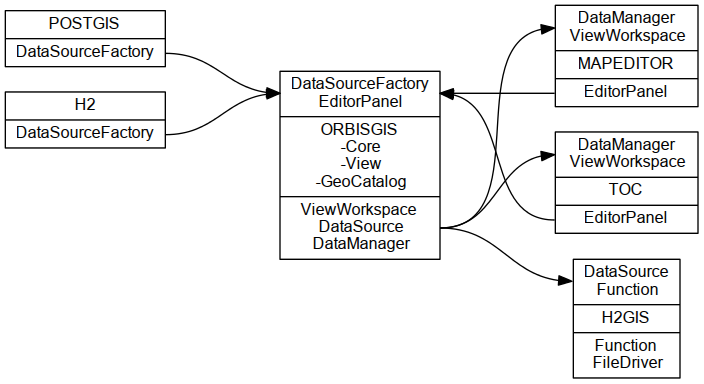

% Introduction to OrbisGIS
% Adam Gouge
% February 17, 2014

# Software architecture

## Modularizing OrbisGIS

# Tools

## Git

* Pro Git book ([EN](http://git-scm.com/book), [FR](http://git-scm.com/book/fr))
* [Interactive tutorial](http://try.github.io)
* [Getting Git - simplified](https://dbrgn.ch/slides/20130207_getting_git)
* [Getting Git - advanced](http://www.slideshare.net/chacon/getting-git)

## IDE

* [Netbeans](https://netbeans.org)
    * [Debugger and profiler](https://netbeans.org/features/java/debugger.html)
* [Eclipse](https://www.eclipse.org)
* [Intellij](https://www.eclipse.org)

## Build systems

* [Maven](http://maven.apache.org)
    * [`pom.xml`](https://github.com/irstv/H2GIS/blob/master/pom.xml) (project object model)
    * [archetypes](https://github.com/irstv/orbisgis-plugin-archetype)
* [Ant](http://ant.apache.org)
* [Gradle](http://www.gradle.org)

## Continuous integration (CI)

* [Travis](https://travis-ci.org)
* [Jenkins](http://jenkins.orbisgis.org)

## Continuous code quality inspection

* [Sonar](http://sonar.orbisgis.org)

## Dynamic ("scripting") languages

* [Groovy](http://groovy.codehaus.org) - the [Python](http://www.python.org) of [Java](https://www.java.com/en)
* [Beanshell](http://www.beanshell.org) - outdated
* See also: [Scala](http://www.scala-lang.org)

# Workflow

## Basic workflow

* Meetings to define major goals
* [Issues](https://github.com/irstv/h2gis/issues?state=open) (tickets) - assign
* Commits
    * [Code](https://github.com/irstv/H2GIS/network)
    * [In-line documentation](http://javadoc.orbisgis.org/latest/h2gis/classes.html)
    * [Unit tests](http://sonar.orbisgis.org/dashboard/index/2649)
* [Pull requests](https://github.com/irstv/h2gis/pulls)
* Approval -> Merge into master
* Update [wiki](https://github.com/irstv/orbisgis/wiki) / [website](http://www.h2gis.org/)
